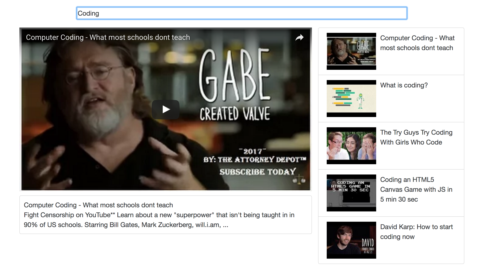

# Youtube App
This app uses YouTube's API to search for, display and play videos.



### Installation

```
> git clone https://github.com/LawynnJana/youtube-player.git
> cd youtube-player
> npm install
```
### Running
```
> npm start
```
Open a browser and enter localhost:8080 in the address bar.
Enter a string in the search bar to display relevant videos.
Click on a video to play.
